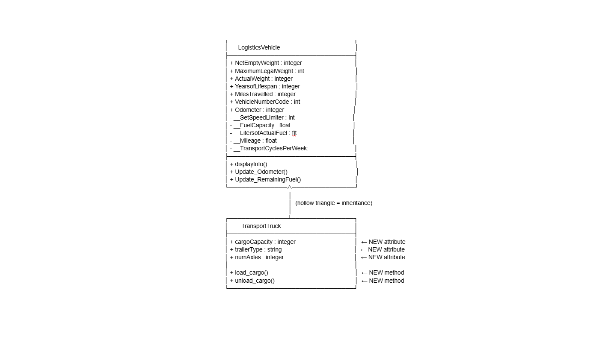
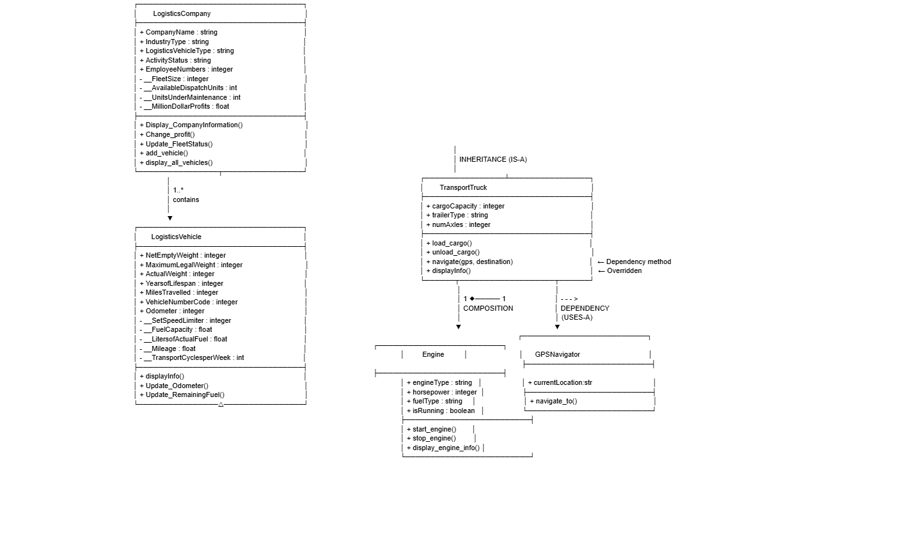
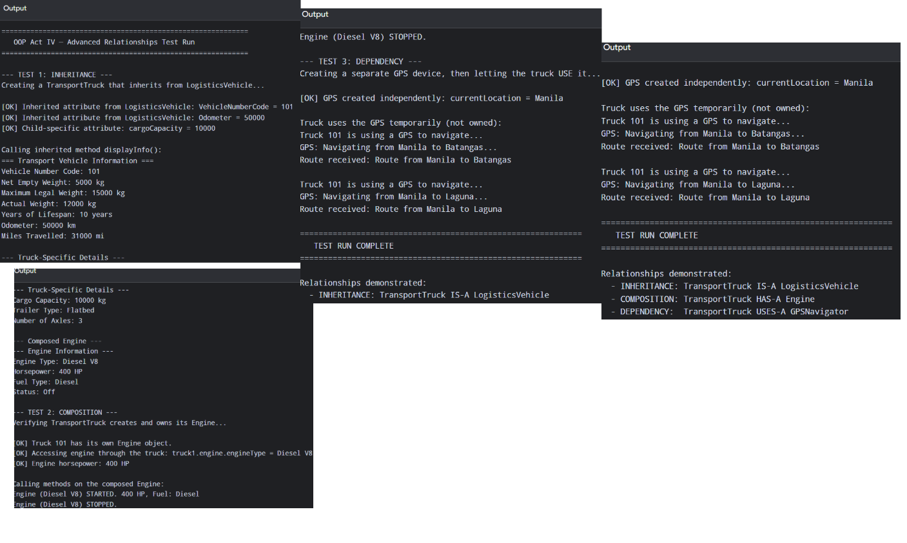
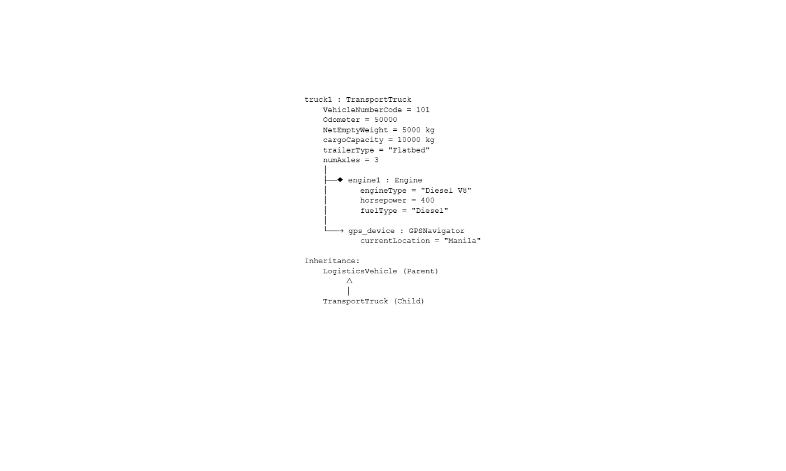

# Advanced Class Relationships

## Previous Activities

[classAttrib](classAttributesMethods.md)
[classRel](classRelationships.md)

## Existing System Description:

Classes that currently exists in my system:
Class 1: LogisticsCompany, Class 2: LogisticsVehicle

Problems/Limitations in my current system:
The LogisticsVehicle class currently has many attributes that apply to all vehicle types, but no way to distinguish between specialized vehicles (like trucks, vans, or ships). As the system grows, this will lead to either bloated general-purpose classes or repeated code for each vehicle type.

## Inheritance Relationship

Parent: LogisticsVehicle

Child: TransportTruck

Explanation: TransportTruck is a type of LogisticsVehicle because it shares all the general properties of a logistics vehicle (weight, fuel, mileage, vehicle number code) while adding specialized attributes unique to trucks, such as cargo capacity and trailer type. This follows the IS-A principle: a TransportTruck IS-A LogisticsVehicle.

## Inheritance UML

## Composition/Aggregation

Relationship: Composition

Explanation:
    Class containing another object: TransportTruck

    Contained object: Engine

    Why: I chose composition because the engine is a fundamental, inseparable part of TransportTruck. In my system model, a truck cannot function or even meaningfully exist without its engine. The engine is created by the truck itself inside its '__init__()' and is owned exclusively by that truck. If the truck is removed from the system, the engine is removed as well, demonstrating a strong dependency of the part to the whole.

## Advanced UML Diagram

## Python Implementation

[Source Code](advancedRelationships.py)

## Test Run

## Object Diagram

## Reflection

1. Why did you choose your inheritance relationship? Explain why your child class is a type of your parent class.

### I chose LogisticsVehicle as the parent and TransportTruck as the child because a truck is naturally a specific type of logistics vehicle. The parent class holds all general vehicle attributes like weight, fuel, and mileage, so the child only needs to add truck-specific features like cargo capacity and trailer type. This follows the IS-A principle: a TransportTruck IS-A LogisticsVehicle. 

2. How did inheritance reduce duplicate code? Identify attributes or methods that were reused.

### Inheritance let TransportTruck reuse all the attributes and methods already defined in LogisticsVehicle through super().__init__(). The attributes NetEmptyWeight, MaximumLegalWeight, Odometer, and VehicleNumberCode were inherited without rewriting, and the methods displayInfo() and Update_Odometer() were reused directly. Only truck-specific attributes and methods had to be written in the child class.

3. Why is your HAS-A relationship Composition or Aggregation? Explain the lifecycle relationship between the two objects.

### I chose Composition because the Engine is an inseparable part of the TransportTruck. The truck creates its own engine inside __init__() using self.engine = Engine(...), so the engine does not exist before the truck is created and cannot be shared. If the truck is removed, its engine is removed too, showing a strict "part-of" lifecycle.

4. What is the difference between Association from Part III and the advanced relationship you implemented?

### In Part III, the Association between LogisticsCompany and LogisticsVehicle was a simple "contains" connection where vehicles could exist independently. In Part IV, I added stronger relationships: Inheritance (IS-A), Composition (strict ownership), and Dependency (temporary usage). The key difference is that Association is weak and general, while advanced relationships enforce specific rules about ownership, lifecycle, and usage. 

5. How does your design follow the DRY principle?

### My design follows DRY by writing shared logic only once. LogisticsVehicle holds all general vehicle code, so TransportTruck inherits it instead of rewriting it. The Engine class is reusable across any vehicle type, and GPSNavigator is standalone for any class that needs navigation. This avoids repetition and keeps the system easy to maintain. 
