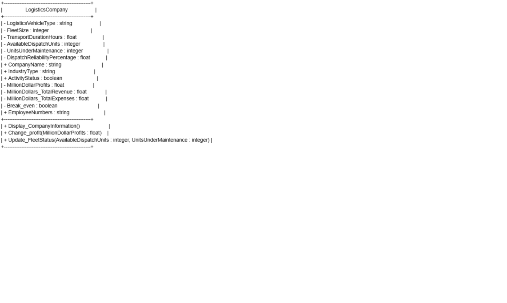
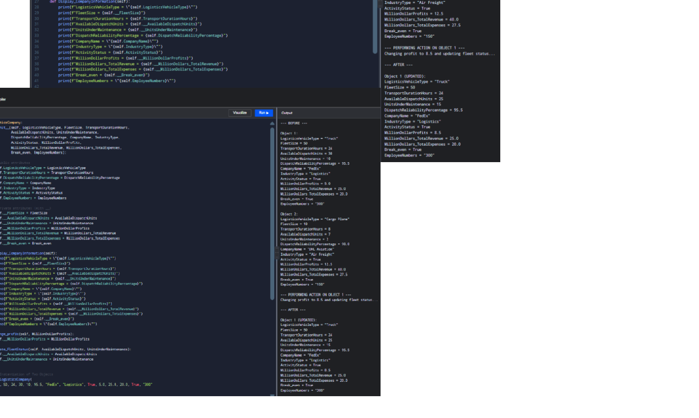
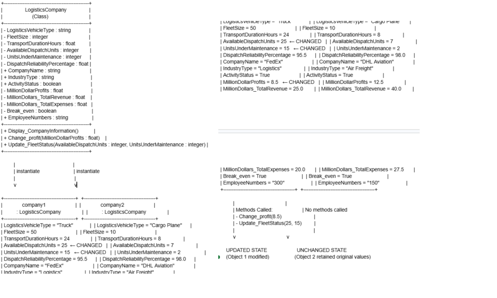

# Class Attributes and Methods

## Previous Design
Link to my previous activity:
[classObjectUML.md](classObjectUML.md)

## Design Revision
No major changes were made to my original class design. The attributes and methods remained the same as in my UML diagram. The only revision was implementing the methods with actual Python code instead of just placeholders, and properly marking private attributes with double underscores (`__`) in the Python implementation.

## Visibility Decisions

| Attribute | Data Type | Visibility | Reason |
|---|---|---|---|
| LogisticsVehicleType | string | Public | Accessed often for dispatch operations and displayed in company information |
| FleetSize | integer | Private | Should only be modified through methods to maintain data integrity |
| TransportDurationHours | float | Public | Used frequently for delivery time calculations and trip planning |
| AvailableDispatchUnits | integer | Private | Must be controlled via Update_FleetStatus() to ensure accurate fleet tracking |
| UnitsUnderMaintenance | integer | Private | Must be controlled via Update_FleetStatus() to maintain accurate maintenance records |
| DispatchReliabilityPercentage | float | Public | Read-only value displayed in reports for performance tracking |
| CompanyName | string | Public | Frequently displayed in company information and reports |
| IndustryType | string | Public | Read-only identifier displayed in company information |
| ActivityStatus | boolean | Public | Checked often for operational decisions and displayed in reports |
| MillionDollarProfits | float | Private | Modified only through Change_profit() to prevent unauthorized changes |
| MillionDollars_TotalRevenue | float | Private | Modified through financial methods to ensure data consistency |
| MillionDollars_TotalExpenses | float | Private | Modified through financial methods to ensure data consistency |
| Break_even | boolean | Private | Calculated internally based on revenue and expenses |
| EmployeeNumbers | string | Public | Displayed in company information for reporting purposes |

## Updated UML Class Diagram

## Python Implementation
[View Python Source](classImplementation.py)

## Test Run

## Object Diagram

## Analysis

### Why did you make your chosen attribute private?
I made attributes like `__AvailableDispatchUnits`, `__UnitsUnderMaintenance`, and `__MillionDollarProfits` private because they represent sensitive business data that should not be modified directly. If other parts of the program could change these directly, it could lead to incorrect fleet status reports or inaccurate financial calculations. For example, if `__AvailableDispatchUnits` could be changed without updating `__UnitsUnderMaintenance`, the total fleet count would no longer be consistent, causing confusion about how many vehicles are actually available.

### Which method changes the state of your object?
The `Update_FleetStatus()` method changes the state of the object by modifying both `__AvailableDispatchUnits` and `__UnitsUnderMaintenance` together. This ensures that when vehicles are moved from available to maintenance (or vice versa), both values are updated correctly and the total fleet size remains consistent. The `Change_profit()` method also changes the state by updating the `__MillionDollarProfits` attribute when new profit data is provided.

### How did your two objects demonstrate that instances are independent?
In my test run, `company1` was modified using `Change_profit(8.5)` and `Update_FleetStatus(25, 15)`, while `company2` was left unchanged. The output showed that `company1`'s `AvailableDispatchUnits` changed from 30 to 25, `UnitsUnderMaintenance` changed from 10 to 15, and `MillionDollarProfits` changed from 5.0 to 8.5. Meanwhile, `company2` retained its original values of 7, 2, and 12.5 respectively. This clearly demonstrates that each object maintains its own separate state and changes to one do not automatically affect the other.

### What is the difference between your class diagram and your object diagram?
The class diagram shows the blueprint of the `LogisticsCompany` class with all its attributes (showing only data types) and methods, representing the general structure that every object will have. The object diagram, however, shows specific instances (`company1` and `company2`) with actual values stored in those attributes. For example, the class diagram shows `MillionDollarProfits : float`, while the object diagram shows `MillionDollarProfits = 8.5` for `company1` and `MillionDollarProfits = 12.5` for `company2`. The class diagram is the template, while the object diagram is a snapshot of real objects with real data.
