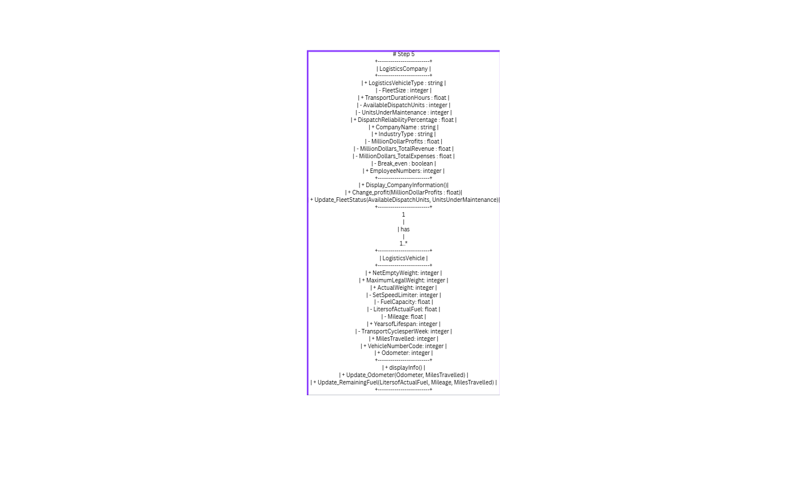
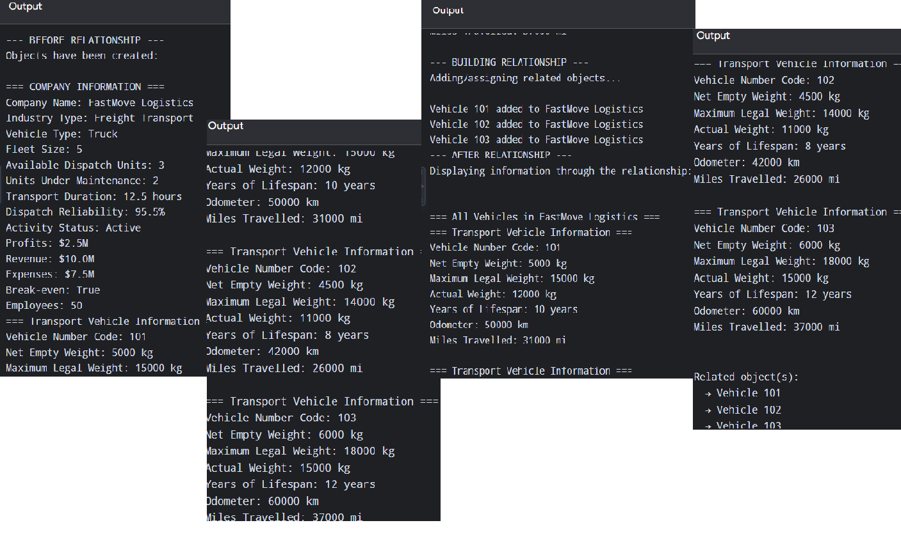
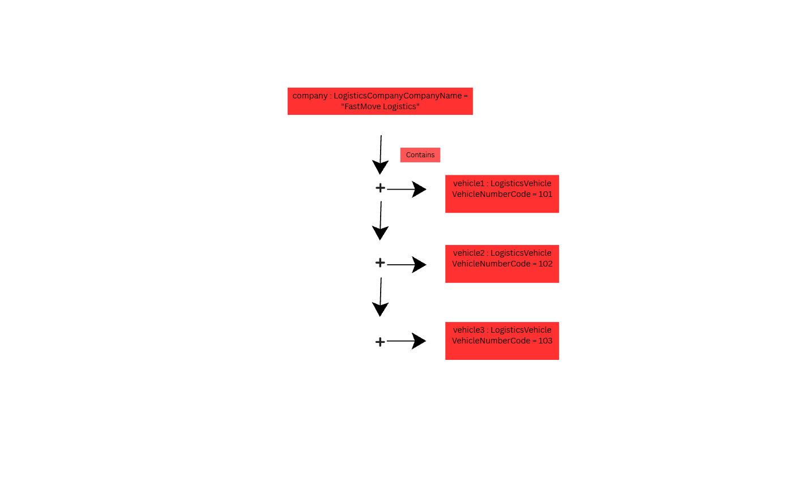

# Class Relationships: Association and Multiplicity

## Previous Work

[Part I - Classes and Objects](classObjectUML.md)  
[Part II - Class Attributes and Methods](classAttributesMethods.md)

## Existing Class

**Class:** `LogisticsCompany`  
**Description:** Represents a logistics company with attributes like company name, industry type, fleet size, employee numbers, profits, and dispatch reliability. It manages the company's operations and contains a list of vehicles.

## New Related Class

**Class:** `LogisticsVehicle`  
**Description:** Represents a vehicle used by the logistics company, with attributes like weight, fuel capacity, mileage, odometer, and vehicle number code. It handles vehicle-specific behaviors like updating odometer and fuel.

## Association

**Relationship:** `LogisticsCompany` contains `LogisticsVehicle`  
**Explanation:** A logistics company owns and manages one or more logistics vehicles. The company stores `LogisticsVehicle` object references in a list called `vehicles`, and adds them through the `add_vehicle()` method.

## Multiplicity

**Multiplicity:** 1..* (One to Many)  
**Explanation:** A logistics company must have at least one vehicle to operate, and can have many vehicles as it grows. This fits the 1..* multiplicity because the company needs one or more vehicles, but each vehicle belongs to only one company.

## UML Class Relationship Diagram

## Python Implementation

[View Python Source](classRelationships.py)

## Test Run

## Object Relationship Diagram

## Analysis

### What is the association between your two classes?

The association between my two classes is a "has-a" relationship, where `LogisticsCompany` contains `LogisticsVehicle`. This means a logistics company owns, manages, and keeps track of the vehicles that carry out its delivery operations. In my Python code, this is represented by the `vehicles` list inside `LogisticsCompany` that stores `LogisticsVehicle` objects.

### What multiplicity did you choose and why?

I chose 1..* (one-to-many), meaning one `LogisticsCompany` can have one or more `LogisticsVehicle` objects. This fits my system because a functioning logistics company would realistically need multiple vehicles. A 1:1 relationship would not make sense because a company with only one vehicle would be severely limited.

### How did you implement the relationship in Python?

I implemented the relationship by adding an instance attribute called `self.vehicles = []` inside the `LogisticsCompany.__init__()` method. This list stores the `LogisticsVehicle` objects that belong to the company. I also added a method called `add_vehicle(self, vehicle)` that appends a vehicle object into that list.

### Why did you store an object reference instead of copying its data?

I stored an object reference instead of copying its data because the relationship should exist between the actual objects, not between duplicated values. If I stored only the `VehicleNumberCode` as a string or number, the company would lose access to all other attributes and methods of that vehicle. For example, when I call `company.display_all_vehicles()`, the method loops through the `vehicles` list and calls `vehicle.displayInfo()` on each object, which only works because the list contains actual objects.

### If your relationship uses many, why is a list appropriate?

A list is appropriate for my "many" relationship because `LogisticsCompany` needs to hold an unknown, growing number of `LogisticsVehicle` objects. A list can be appended to at any time using `append()`, so new vehicles can be added without changing the structure of the class. In my implementation, `self.vehicles` contains actual `LogisticsVehicle` object references such as `vehicle1`, `vehicle2`, and `vehicle3` with codes 101, 102, and 103.

